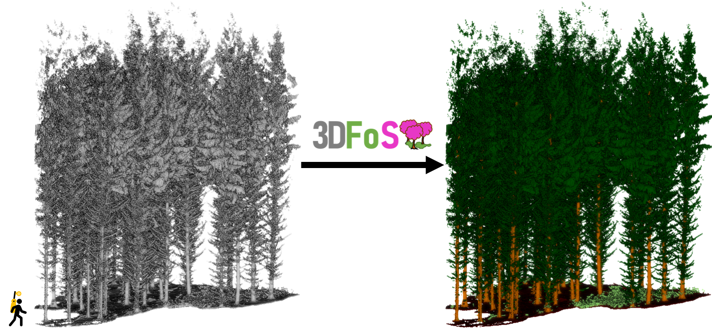

# 3DFoS


Minimal PTV3 standalone for forestry application, inspired by [sonata](https://github.com/facebookresearch/sonata) standalone.
## What it does
This tool takes raw ground-based forest point clouds and performs semantic segmentation into four classes:
*   **Ground:** Soil, leaf litter, and low-lying topography.
*   **Understorey:** Shrubs, saplings, and other understorey elements.
*   **Stems:** Main trunk architecture.
*   **Canopy:** foliage and branches.



## Key Features
*   **Performance:** Powered by the **Point Transformer V3 (PTV3)** architecture, the top performer in our 2026 benchmark among other state-of-the-art 3D deep learning architectures: [PointNeXt](https://github.com/guochengqian/openpoints), [SuperPoint Transformer](https://github.com/drprojects/superpoint_transformer) and [OA-CNN](https://github.com/pointcept/pointcept) (paper coming soon!).
*   **High-Resolution:** Optimized at a **0.05 m voxel resolution**, allowing for the detection of thin stems and complex understorey textures.
*   **Pre-Trained:** The underlying weights were trained on [SegmentedForests](https://doi.org/10.1093/forestry/cpaf062), a heterogeneous dataset of 14 plots, covering both **coniferous and broadleaf** stands across various maturity stages, as well as both **TLS** and **MLS** point clouds.
*   **Zero-Setup Inference:** A pre-compiled executable is available.

Please cite [PointCept](https://github.com/pointcept/pointcept), [PTV3](https://arxiv.org/abs/2312.10035) and [Sonata](https://github.com/facebookresearch/sonata) if you use this work (see PointCept for details).

## Changes vs sonata:

- Added a "clean" `uv` packaging
- Removed `torch_scatter` dependencies (replaced scatter from `PYG` by pure `torch` calls, simplify dependencies).
- Replaced `spconv` by `Torchsparse++` / `nanoTSparse` for sparse convolution. nanoTSparse is not affected by `CUMM` bugs (like https://github.com/FindDefinition/cumm/issues/26) and is easier
  to package / maintain. We do not provide yet pre compiled version of `nanoTSparse`, you may need a `C/C++` and `CUDA` compiler in order to run this code.
- Use `torch` built-in `SDPA` to levrage efficient and memory friendly attention kernels. This removes the need of `flash-attn` package.
- Added a dedicated inference demo/script for 3DFos/SegmentedForest datasets.

## Installation:

```
uv sync --extra cu130 [or --extra cu128 or --extra cpu]
```

then

```
uv sync --extra cu130 --extra nanotsparse
```

on Windows system, it might be necessary to set `DUSTUTILS_USE_SDK` env variable in order to compile `nanoTSparse`.

i.e on Windows Developer PowerShell` terminal session. 

```
$env:DUSTUTILS_USE_SDK = 1
uv sync --extra cu130 --extra nanotsparse
```

Flash attention lowers memory usage and improves runtime, but it's not mandatory.
if you want to use `flash-attn` package, you have to run this command **AFTER** the first one.

```
uv sync --extra cu130 --extra nanotsparse --extra flash-attn
```

Flash attention is only compatible with NVIDIA cards that have a compute capability of 8.0+.
You might need the CUDA compiler, which is part of the CUDA toolkit, in order to compile flash-attn.
This could be very time-consuming, particularly on Windows. (On Linux, the install script will attempt to download a pre-compiled binary wheel from GitHub.)

## Usage

```
uv run 3DFos <path_to_the_cloud.las|ply> [--output_path seg_result.las] [--model_path model.ckpt] [--grid_size 0.05] [--backbone ptv3 | litept]
```

An [example point cloud](https://drive.google.com/file/d/1Dexdy0uVf58Nh7TfX1srp9FMJ9HrrxME/view?usp=sharing) is available from the 3DFin tutorial.

`model_path` flag is optional and latest weights are automatically downloaded from the [release page](https://github.com/3DFin/3DFos/releases) on Github.

Point clouds can be either in las/laz or ply format.

For now, only the weights for PTV3 and LitePT trained at a 0.05 m voxel size with full 3DFin features (i.e., distance to axis and elevation) are publicly available. This means you **must** first run 3DFin on your point cloud and then provide its output to 3DFos. Normal features are computed on the fly.

You can adapt the voxel size. For example, you could run inference at a 0.01 m voxel size for a model trained at 0.05 m to lower runtime and resource consumption, at the cost of slightly reduced accuracy of the results.

## Funding
PTV3-3DFos has been developed at the Centre of Wildfire Research of Swansea University (UK) in collaboration with the Research Institute of Biodiversity (CSIC, Spain) and the Department of Mining Exploitation of the University of Oviedo (Spain).

Funding provided by the UK NERC project (NE/T001194/1):

'Advancing 3D Fuel Mapping for Wildfire Behaviour and Risk Mitigation Modelling'

and by the Spanish Knowledge Generation project (PID2021-126790NB-I00):

‘Advancing carbon emission estimations from wildfires applying artificial intelligence to 3D terrestrial point clouds’.

## TODOs:

- Provide a pixi file in order to simplify installation / compilation?
- Use point closest to the voxel center.
- Add a spatial tiling mechanism? (First pass of a Lite NN `binary seg` + PCA for overlapping tiles + inference + Logit mean between tiles)
- Use torch varlen.
