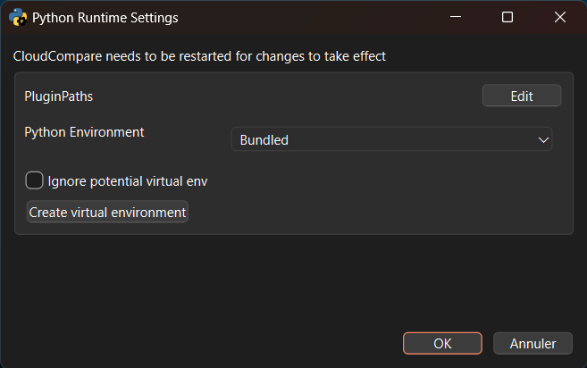
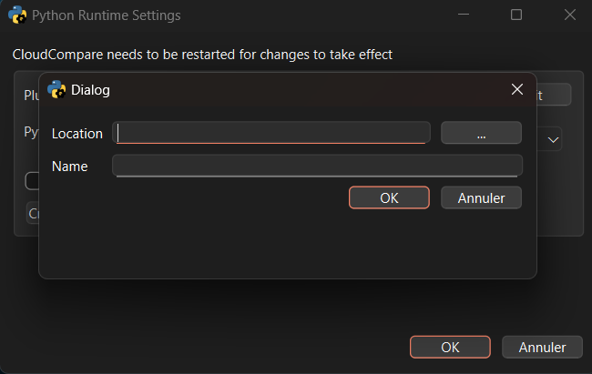
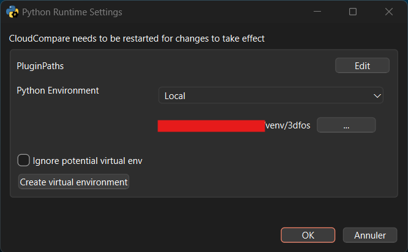
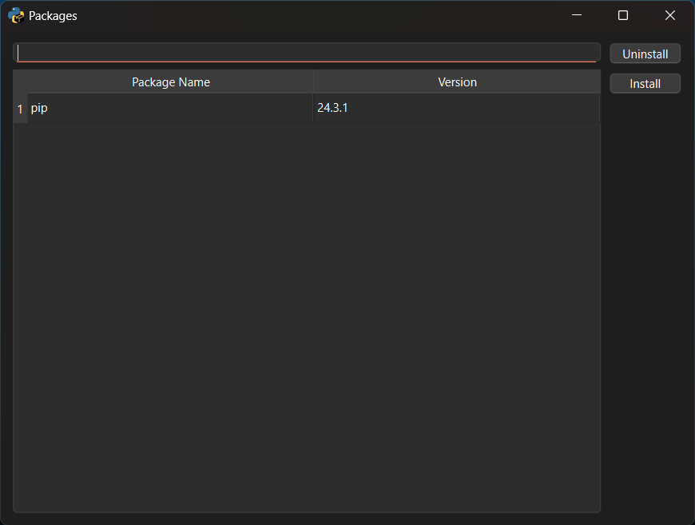
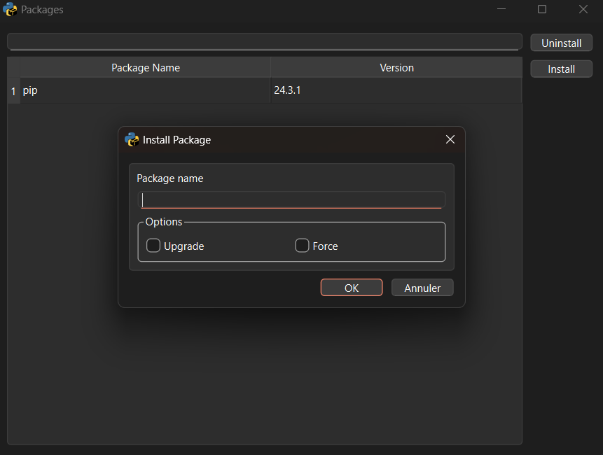

CloudCompare Plugin Installation
=========================

Thanks to [CloudCompare-PythonRuntime](https://github.com/tmontaigu/CloudCompare-PythonRuntime) plugin, 3DFoS could be used inside CloudCompare as a plugin. However, it is not included by default in the CloudCompare distribution and requires additional user actions to install.

This document focuses on the **Windows** system using the **official CloudCompare distribution** and only supports `3DFoS` on cpu (no CUDA compatibility for now).
For macOS and Linux, or Windows+CUDA the process depends on the type of installation (e.g., `Flatpak`, bundle, or compiled from source) and may require setting up a virtual environment using uv or pip. For a general overview, refer to the main [README](https://github.com/3DFin/3DFos). In this case, the only hard requirement is that the Python version of the virtual environment must be compatible and you might need a compiler toolchain installed on your computer.

## Windows installation

### Donwload CloudCompare

You need [CloudCompare 2.14.beta ](https://www.cloudcompare.org) at least. The first version known to be comptible with this install procedure is the beta from 07-23-2026.

### Create a dedicated virtual env

By default CloudCompare come with a minimal Python distribution installed and sometimes you do not have to right to modify it, and in all case it's very risky and error prone. To handle this, `CloudCompare-PythonRuntime` provide the habitlity to create a self contained and isolated Python environment (called a `virtual environement` or `venv`) in order to install additional Python packages. we will take advantage of this to install 3DFoS plugin.

launch `CloudCompare` and go to `plugins > Python plugin > show settings` menu

You should see this window



click on the "create virtual environement" button



Choose the path where you want to host your virtual environment, as well as its name, then click OK.
This will create a directory with your chosen name inside the specified path. For example, you could name it "3dfos" and place it in your personal directory.

after a short momenent you should end up with something like this:



**You need to relaunch to make these change take effect**

### Install plugin

Your virtual environment is now created but is empty, it contains no packages, except for pip, Python’s default package installer.

You need to install 3DFoS package. Launch `CloudCompare` and go to `plugins > Python plugin > Package Manager` menu

You should see this



Click on the install button, to open the package installation dialog:



In the "Package Name" input path copy this line...

```
3dfos[cpu, windowsplugin] @ git+https://github.com/3DFin/3DFos.git
```

... and then click ok.

**You need to relaunch on more time to make these change take effect**

3DFoS should now be availabe under `plugins > Python plugin > plugins`

### Virtual env good practices

Do not install additional dependencies or plugins in the 3DFos dedicated virtual environment, as this could break the entire dependency graph of 3DFos. If you need to install other packages, create a separate virtual environment instead.
